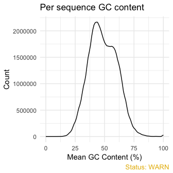
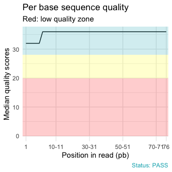
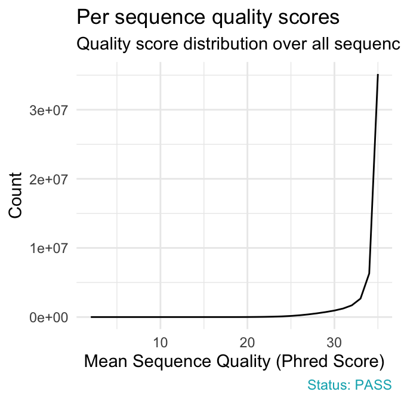
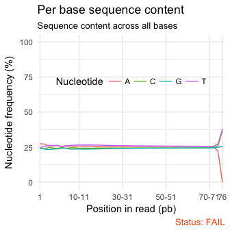
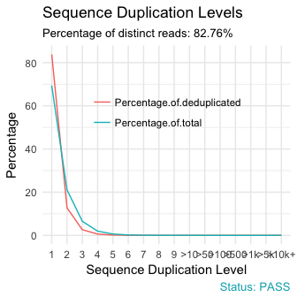

<!-- README.md is generated from README.Rmd. Please edit that file -->
[](https://travis-ci.org/kassambara/fastqcr) [](https://cran.r-project.org/package=fastqcr) [](https://cran.r-project.org/package=fastqcr) [](http://cranlogs.r-pkg.org/badges/grand-total/fastqcr)

<br/>

fastqcr: Quality Control of Sequencing Data
===========================================

The FastQC, written by Simon Andrews at the Babraham Institute, is the most widely used sequence quality assessment tool for evaluating the raw reads from high throughput sequencing data.

It produces, for each sample, an html report and a 'zip' file, which contains a file called fastqc\_data.txt and summary.txt.

If you have hundreds of samples, you’re not going to open up each HTML page. You need some way of looking at these data in aggregate.

The **fastqcr** R package provides helper functions to easily and automatically parse, aggregate and analyze FastQC reports for large numbers of samples.

Additionally, the **fastqcr** package provides a convenient solution for building a multi-QC report and a one-sample FastQC report with the result interpretations.

Examples of QC reports, generated automatically by the **fastqcr** R package, includes:

-   [Multi-QC report for multiple samples](http://www.sthda.com/english/rpkgs/fastqcr/qc-reports/fastqcr-multi-qc-report.html)
-   [One sample QC report (+ interpretation)](http://www.sthda.com/english/rpkgs/fastqcr/qc-reports/sample-qc-report-interpretation.html)
-   [One sample QC report (no interpretation)](http://www.sthda.com/english/rpkgs/fastqcr/qc-reports/sample-qc-report-without-interpretation.html)

Installation and loading
------------------------

Install the latest version from [GitHub](https://github.com/kassambara/fastqcr):

``` r
if(!require(devtools)) install.packages("devtools")
devtools::install_github("kassambara/fastqcr")
```

Load fastqcr:

``` r
library("fastqcr")
```

Quick Start
-----------

``` r
library(fastqcr)

# Aggregating Multiple FastQC Reports into a Data Frame 
#%%%%%%%%%%%%%%%%%%%%%%%%%%%%%%%%%%%%%%%%%%%%%%%%%%%%%

# Demo QC directory containing zipped FASTQC reports
qc.dir <- system.file("fastqc_results", package = "fastqcr")
qc <- qc_aggregate(qc.dir)
qc

# Inspecting QC Problems
#%%%%%%%%%%%%%%%%%%%%%%%%%%%%%%%%%%%%%%%%%%%%%%%%%%%%%

# See which modules failed in the most samples
qc_fails(qc, "module")
# Or, see which samples failed the most
qc_fails(qc, "sample")

# Building Multi QC Reports
#%%%%%%%%%%%%%%%%%%%%%%%%%%%%%%%%%%%%%%%%%%%%%%%%%%%%%
qc_report(qc.dir, result.file = "multi-qc-report" )

# Building One-Sample QC Reports (+ Interpretation)
#%%%%%%%%%%%%%%%%%%%%%%%%%%%%%%%%%%%%%%%%%%%%%%%%%%%%%
qc.file <- system.file("fastqc_results", "S1_fastqc.zip", package = "fastqcr")
qc_report(qc.file, result.file = "one-sample-report",
          interpret = TRUE)
```

Main Functions
--------------

**1) Installing and Running FastQC**

-   **fastqc\_install**(): Install the latest version of FastQC tool on Unix systems (MAC OSX and Linux)

-   **fastqc**(): Run the FastQC tool from R.

**2) Aggregating and Summarizing Multiple FastQC Reports**

-   **qc &lt;- qc\_aggregate**(): Aggregate multiple FastQC reports into a data frame.

-   **summary**(qc): Generates a summary of qc\_aggregate.

-   **qc\_stats**(qc): General statistics of FastQC reports.

**3) Inspecting Problems**

-   **qc\_fails**(qc): Displays samples or modules that failed.

-   **qc\_warns**(qc): Displays samples or modules that warned.

-   **qc\_problems**(qc): Union of **qc\_fails**() and **qc\_warns**(). Display which samples or modules that failed or warned.

**4) Importing and Plotting FastQC Reports**

-   **qc\_read**(): Read FastQC data into R.

-   **qc\_plot**(qc): Plot FastQC data

**5) Building One-Sample and Multi-QC Reports**

-   **qc\_report**(): Create an HTML file containing FastQC reports of one or multiple files. Inputs can be either a directory containing multiple FastQC reports or a single sample FastQC report.

**6) Others**

-   **qc\_unzip**(): Unzip all zipped files in the qc.dir directory. <br/>

Installing FastQC from R
------------------------

You can install automatically the FastQC tool from R as follow:

``` r
fastqc_install()
```

Running FastQC from R
---------------------

The supported [file formats](http://www.bioinformatics.babraham.ac.uk/projects/fastqc/Help/2%20Basic%20Operations/2.1%20Opening%20a%20sequence%20file.html) by FastQC include:

-   FASTQ
-   gzip compressed FASTQ

Suppose that your working directory is organized as follow:

-   home
    -   Documents
        -   FASTQ

where, FASTQ is the directory containing your FASTQ files, for which you want to perform the quality control check.

To run FastQC from R, type this:

``` r
fastqc(fq.dir = "~/Documents/FASTQ", # FASTQ files directory
       qc.dir = "~/Documents/FASTQC", # Results direcory
       threads = 4                    # Number of threads
       )
```

FastQC Reports
--------------

For each sample, FastQC performs a series of tests called *analysis modules*.

These modules include:

-   Basic Statistics,
-   Per base sequence quality,
-   Per tile sequence quality
-   Per sequence quality scores,
-   Per base sequence content,
-   Per sequence GC content,
-   Per base N content,
-   Sequence Length Distribution,
-   Sequence Duplication Levels,
-   Overrepresented sequences,
-   Adapter Content
-   Kmer content

The interpretation of these modules are provided in the official documentation of the [FastQC tool](http://www.bioinformatics.babraham.ac.uk/projects/fastqc/Help/3%20Analysis%20Modules/).

Aggregating Reports
-------------------

Here, we provide an R function **qc\_aggregate()** to walk the FastQC result directory, find all the FASTQC zipped output folders, read the **fastqc\_data.txt** and the **summary.txt** files, and aggregate the information into a data frame.

In the example below, we'll use a demo FastQC output directory available in the fastqcr package.

``` r
library(fastqcr)
# Demo QC dir
qc.dir <- system.file("fastqc_results", package = "fastqcr")
qc.dir
# [1] ""
   
# List of files in the directory
list.files(qc.dir)
# character(0)
```

The demo QC directory contains five zipped folders corresponding to the FastQC output for 5 samples.

Aggregating FastQC reports:

``` r
qc <- qc_aggregate(qc.dir)
qc
```

The aggregated report looks like this:

| sample | module                      | status | tot.seq  | seq.length |  pct.gc|  pct.dup|
|:-------|:----------------------------|:-------|:---------|:-----------|-------:|--------:|
| S1     | Per base sequence content   | FAIL   | 50299587 | 35-76      |      48|    17.24|
| S5     | Per base sequence quality   | PASS   | 65011962 | 35-76      |      48|    18.15|
| S3     | Adapter Content             | PASS   | 67255341 | 35-76      |      49|    22.14|
| S1     | Sequence Duplication Levels | PASS   | 50299587 | 35-76      |      48|    17.24|
| S1     | Basic Statistics            | PASS   | 50299587 | 35-76      |      48|    17.24|
| S3     | Per base sequence quality   | PASS   | 67255341 | 35-76      |      49|    22.14|
| S3     | Per tile sequence quality   | PASS   | 67255341 | 35-76      |      49|    22.14|
| S2     | Per sequence quality scores | PASS   | 50299587 | 35-76      |      48|    15.70|
| S4     | Per tile sequence quality   | PASS   | 67255341 | 35-76      |      49|    19.89|
| S4     | Per sequence quality scores | PASS   | 67255341 | 35-76      |      49|    19.89|

Column names:

-   **sample**: sample names
-   **module**: fastqc modules
-   **status**: fastqc module status for each sample
-   **tot.seq**: total sequences (i.e.: the number of reads)
-   **seq.length**: sequence length
-   **pct.gc**: percentage of GC content
-   **pct.dup**: percentage of duplicate reads

<p>
The table shows, for each sample, the names of tested FastQC modules, the status of the test, as well as, some general statistics including the number of reads, the length of reads, the percentage of GC content and the percentage of duplicate reads.
</p>

Once you have the aggregated data you can use the **dplyr** package to easily inspect modules that failed or warned in samples. For example, the following R code shows samples with warnings and/or failures:

``` r
library(dplyr)
qc %>%
  select(sample, module, status) %>%    
  filter(status %in% c("WARN", "FAIL")) %>%
  arrange(sample)
# # A tibble: 15 × 3
#    sample                       module status
#     <chr>                        <chr>  <chr>
# 1      S1    Per base sequence content   FAIL
# 2      S1      Per sequence GC content   WARN
# 3      S1 Sequence Length Distribution   WARN
# 4      S2    Per base sequence content   FAIL
# 5      S2      Per sequence GC content   WARN
# 6      S2 Sequence Length Distribution   WARN
# 7      S3    Per base sequence content   FAIL
# 8      S3      Per sequence GC content   FAIL
# 9      S3 Sequence Length Distribution   WARN
# 10     S4    Per base sequence content   FAIL
# 11     S4      Per sequence GC content   FAIL
# 12     S4 Sequence Length Distribution   WARN
# 13     S5    Per base sequence content   FAIL
# 14     S5      Per sequence GC content   WARN
# 15     S5 Sequence Length Distribution   WARN
```

<p>
In the next section, we'll describe some easy-to-use functions, available in the <strong>fastqcr</strong> package, for analyzing the aggregated data.
</p>

Summarizing Reports
-------------------

We start by presenting a summary and general statistics of the aggregated data.

### QC Summary

-   R function: **summary**()
-   Input data: aggregated data from **qc\_aggregate**()

``` r
# Summary of qc
summary(qc)
# Source: local data frame [12 x 7]
# Groups: module [?]
# 
#                          module nb_samples nb_fail nb_pass nb_warn
#                           <chr>      <dbl>   <dbl>   <dbl>   <dbl>
# 1               Adapter Content          5       0       5       0
# 2              Basic Statistics          5       0       5       0
# 3                  Kmer Content          5       0       5       0
# 4     Overrepresented sequences          5       0       5       0
# 5            Per base N content          5       0       5       0
# 6     Per base sequence content          5       5       0       0
# 7     Per base sequence quality          5       0       5       0
# 8       Per sequence GC content          5       2       0       3
# 9   Per sequence quality scores          5       0       5       0
# 10    Per tile sequence quality          5       0       5       0
# 11  Sequence Duplication Levels          5       0       5       0
# 12 Sequence Length Distribution          5       0       0       5
# # ... with 2 more variables: failed <chr>, warned <chr>
```

Column names:

-   *module*: fastqc modules
-   *nb\_samples*: the number of samples tested
-   *nb\_pass, nb\_fail, nb\_warn*: the number of samples that passed, failed and warned, respectively.
-   *failed, warned*: the name of samples that failed and warned, respectively.

<p>
The table shows, for each FastQC module, the number and the name of samples that failed or warned.
</p>

### General statistics

-   R function: **qc\_stats**()
-   Input data: aggregated data from **qc\_aggregate**()

``` r
qc_stats(qc)
# # A tibble: 5 × 5
#   sample pct.dup pct.gc  tot.seq seq.length
#    <chr>   <dbl>  <dbl>    <chr>      <chr>
# 1     S1   17.24     48 50299587      35-76
# 2     S2   15.70     48 50299587      35-76
# 3     S3   22.14     49 67255341      35-76
# 4     S4   19.89     49 67255341      35-76
# 5     S5   18.15     48 65011962      35-76
```

Column names:

-   *pct.dup*: the percentage of duplicate reads,
-   *pct.gc*: the percentage of GC content,
-   *tot.seq*: total sequences or the number of reads and
-   *seq.length*: sequence length or the length of reads.

<p>
The table shows, for each sample, some general statistics such as the total number of reads, the length of reads, the percentage of GC content and the percentage of duplicate reads
</p>

Inspecting Problems
-------------------

Once you’ve got this aggregated data, it’s easy to figure out what (if anything) is wrong with your data.

1.  **R functions**. You can inspect problems per either modules or samples using the following R functions:

-   **qc\_fails**(qc): Displays samples or modules that failed.
-   **qc\_warns**(qc): Displays samples or modules that warned.
-   **qc\_problems**(qc): Union of **qc\_fails**() and **qc\_warns**(). Display which samples or modules that failed or warned.

1.  **Input data**: aggregated data from **qc\_aggregate**()

2.  **Output data**: Returns samples or FastQC modules with failures or warnings. By default, these functions return a compact output format. If you want a stretched format, specify the argument *compact = FALSE*.

The format and the interpretation of the outputs depend on the additional argument *element*, which value is one of c("sample", "module").

-   If **element = "sample"** (default), results are samples with failed and/or warned modules. The results contain the following columns:
    -   sample (sample names),
    -   nb\_problems (the number of modules with problems),
    -   module (the name of modules with problems).
-   If **element = "module"**, results are modules that failed and/or warned in the most samples. The results contain the following columns:
    -   module (the name of module with problems),
    -   nb\_problems (the number of samples with problems),
    -   sample (the name of samples with problems)

### Per Module Problems

-   **Modules that failed in the most samples**:

``` r
# See which module failed in the most samples
qc_fails(qc, "module")
# # A tibble: 2 × 3
#                      module nb_problems             sample
#                       <chr>       <int>              <chr>
# 1 Per base sequence content           5 S1, S2, S3, S4, S5
# 2   Per sequence GC content           2             S3, S4
```

<p>
For each module, the number of problems (failures) and the name of samples, that failed, are shown.
</p>

-   **Modules that warned in the most samples**:

``` r
# See which module warned in the most samples
qc_warns(qc, "module")
# # A tibble: 2 × 3
#                         module nb_problems             sample
#                          <chr>       <int>              <chr>
# 1 Sequence Length Distribution           5 S1, S2, S3, S4, S5
# 2      Per sequence GC content           3         S1, S2, S5
```

-   **Modules that failed or warned**: Union of qc\_fails() and qc\_warns()

``` r
# See which modules failed or warned.
qc_problems(qc, "module")
# # A tibble: 3 × 3
#                         module nb_problems             sample
#                          <chr>       <int>              <chr>
# 1    Per base sequence content           5 S1, S2, S3, S4, S5
# 2      Per sequence GC content           5 S1, S2, S3, S4, S5
# 3 Sequence Length Distribution           5 S1, S2, S3, S4, S5
```

The output above is in a compact format. For a stretched format, type this:

``` r
qc_problems(qc, "module", compact = FALSE)
# # A tibble: 15 × 4
#                          module nb_problems sample status
#                           <chr>       <int>  <chr>  <chr>
# 1     Per base sequence content           5     S1   FAIL
# 2     Per base sequence content           5     S2   FAIL
# 3     Per base sequence content           5     S3   FAIL
# 4     Per base sequence content           5     S4   FAIL
# 5     Per base sequence content           5     S5   FAIL
# 6       Per sequence GC content           5     S3   FAIL
# 7       Per sequence GC content           5     S4   FAIL
# 8       Per sequence GC content           5     S1   WARN
# 9       Per sequence GC content           5     S2   WARN
# 10      Per sequence GC content           5     S5   WARN
# 11 Sequence Length Distribution           5     S1   WARN
# 12 Sequence Length Distribution           5     S2   WARN
# 13 Sequence Length Distribution           5     S3   WARN
# 14 Sequence Length Distribution           5     S4   WARN
# 15 Sequence Length Distribution           5     S5   WARN
```

<p>
In the the stretched format each row correspond to a unique sample. Additionally, the status of each module is specified.
</p>

It's also possible to display problems for one or more specified modules. For example,

``` r
qc_problems(qc, "module",  name = "Per sequence GC content")
# # A tibble: 5 × 4
#                    module nb_problems sample status
#                     <chr>       <int>  <chr>  <chr>
# 1 Per sequence GC content           5     S3   FAIL
# 2 Per sequence GC content           5     S4   FAIL
# 3 Per sequence GC content           5     S1   WARN
# 4 Per sequence GC content           5     S2   WARN
# 5 Per sequence GC content           5     S5   WARN
```

<p>
Note that, partial matching of name is allowed. For example, name = "Per sequence GC content" equates to name = "GC content".
</p>

``` r
qc_problems(qc, "module",  name = "GC content")
```

### Per Sample Problems

-   **Samples with one or more failed modules**

``` r
# See which samples had one or more failed modules
qc_fails(qc, "sample")
# # A tibble: 5 × 3
#   sample nb_problems                                             module
#    <chr>       <int>                                              <chr>
# 1     S3           2 Per base sequence content, Per sequence GC content
# 2     S4           2 Per base sequence content, Per sequence GC content
# 3     S1           1                          Per base sequence content
# 4     S2           1                          Per base sequence content
# 5     S5           1                          Per base sequence content
```

<p>
For each sample, the number of problems (failures) and the name of modules, that failed, are shown.
</p>

-   **Samples with failed or warned modules**:

``` r
# See which samples had one or more module with failure or warning
qc_problems(qc, "sample", compact = FALSE)
# # A tibble: 15 × 4
#    sample nb_problems                       module status
#     <chr>       <int>                        <chr>  <chr>
# 1      S1           3    Per base sequence content   FAIL
# 2      S1           3      Per sequence GC content   WARN
# 3      S1           3 Sequence Length Distribution   WARN
# 4      S2           3    Per base sequence content   FAIL
# 5      S2           3      Per sequence GC content   WARN
# 6      S2           3 Sequence Length Distribution   WARN
# 7      S3           3    Per base sequence content   FAIL
# 8      S3           3      Per sequence GC content   FAIL
# 9      S3           3 Sequence Length Distribution   WARN
# 10     S4           3    Per base sequence content   FAIL
# 11     S4           3      Per sequence GC content   FAIL
# 12     S4           3 Sequence Length Distribution   WARN
# 13     S5           3    Per base sequence content   FAIL
# 14     S5           3      Per sequence GC content   WARN
# 15     S5           3 Sequence Length Distribution   WARN
```

To specify the name of a sample of interest, type this:

``` r
qc_problems(qc, "sample", name = "S1")
# # A tibble: 3 × 4
#   sample nb_problems                       module status
#    <chr>       <int>                        <chr>  <chr>
# 1     S1           3    Per base sequence content   FAIL
# 2     S1           3      Per sequence GC content   WARN
# 3     S1           3 Sequence Length Distribution   WARN
```

Building an HTML Report
-----------------------

The function **qc\_report**() can be used to build a report of FastQC outputs. It creates an HTML file containing FastQC reports of one or multiple samples.

Inputs can be either a directory containing multiple FastQC reports or a single sample FastQC report.

### Create a Multi-QC Report

We'll build a multi-qc report for the following demo QC directory:

``` r
# Demo QC Directory
qc.dir <- system.file("fastqc_results", package = "fastqcr")
qc.dir
# [1] ""
```

``` r
# Build a report
qc_report(qc.dir, result.file = "~/Desktop/multi-qc-result",
          experiment = "Exome sequencing of colon cancer cell lines")
```

<p>
An example of report is available at: <a href= "http://www.sthda.com/english/rpkgs/fastqcr/qc-reports/fastqcr-multi-qc-report.html", target = "_blank"> fastqcr multi-qc report</a>
</p>

### Create a One-Sample Report

We'll build a report for the following demo QC file:

``` r
 qc.file <- system.file("fastqc_results", "S1_fastqc.zip", package = "fastqcr")
qc.file
# [1] ""
```

-   **One-Sample QC report with plot interpretations**:

``` r
 qc_report(qc.file, result.file = "~/Desktop/result",
   interpret = TRUE)
```

<p>
An example of report is available at: <a href= "http://www.sthda.com/english/rpkgs/fastqcr/qc-reports/sample-qc-report-interpretation.html", target = "_blank"> One sample QC report with interpretation</a>
</p>

-   **One-Sample QC report without plot interpretations**:

``` r
 qc_report(qc.file, result.file = "~/Desktop/result",
   interpret = TRUE)
```

<p>
An example of report is available at: <a href= "http://www.sthda.com/english/rpkgs/fastqcr/qc-reports/sample-qc-report-without-interpretation.html", target = "_blank"> One sample QC report without interpretation</a>
</p>

Plotting
--------

We'll visualize the output for sample 1:

``` r
# Demo file
qc.file <- system.file("fastqc_results", "S1_fastqc.zip",  package = "fastqcr")
qc.file
# [1] ""
```

We start by reading the output using the function **qc\_read**(), which returns a list of tibbles containing the data for specified modules:

``` r
# Read all modules
qc <- qc_read(qc.file)
# Elements contained in the qc object
names(qc)
#  [1] "summary"                       "basic_statistics"             
#  [3] "per_base_sequence_quality"     "per_tile_sequence_quality"    
#  [5] "per_sequence_quality_scores"   "per_base_sequence_content"    
#  [7] "per_sequence_gc_content"       "per_base_n_content"           
#  [9] "sequence_length_distribution"  "sequence_duplication_levels"  
# [11] "overrepresented_sequences"     "adapter_content"              
# [13] "kmer_content"                  "total_deduplicated_percentage"
```

The function **qc\_plot**() is used to visualized the data of a specified module. Allowed values for the argument modules include one or the combination of:

-   "Summary",
-   "Basic Statistics",
-   "Per base sequence quality",
-   "Per sequence quality scores",
-   "Per base sequence content",
-   "Per sequence GC content",
-   "Per base N content",
-   "Sequence Length Distribution",
-   "Sequence Duplication Levels",
-   "Overrepresented sequences",
-   "Adapter Content"

``` r
qc_plot(qc, "Per sequence GC content")

qc_plot(qc, "Per base sequence quality")

qc_plot(qc, "Per sequence quality scores")

qc_plot(qc, "Per base sequence content")

qc_plot(qc, "Sequence duplication levels")
```



Useful Links
------------

-   FastQC report for a [good Illumina dataset](http://www.bioinformatics.babraham.ac.uk/projects/fastqc/good_sequence_short_fastqc.html)
-   FastQC report for a [bad Illumina dataset](http://www.bioinformatics.babraham.ac.uk/projects/fastqc/bad_sequence_fastqc.html)
-   [Online documentation for each FastQC report](http://www.bioinformatics.babraham.ac.uk/projects/fastqc/Help/3%20Analysis%20Modules/)
